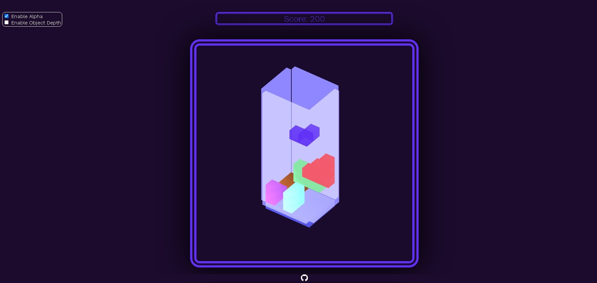

  <h1 align="center">3D TETRIS FROM SCRATCH USING WEBGL</h1>

<a href="devmilk.github.io/3d-tetris/">Click To Play Game</a>

<h2 align="center">Screenshots</h2>

  

<h2 align="center">Gameplay</h2>

    WASD or Mouse Drag on object: Movement
    SPACE: Fast drop
    Q: Rotate 90 degrees around the y-xis
    E: Rotate 90 degrees around the x-axis
    Mouse Wheel Scroll: Zoom in/out to the point of cursor 
    Mouse Wheel Button Drag: Move camera position
    Arrows or Mouse Drag: Rotate camera perspective
---
<h2 align="center">Options</h2>

    Height: Changes ground's length on z-axis and changes Invisible Walls' location based on it 
    Width: Changes ground's length on x-axis and changes Invisible Walls' location based on it 
    Difficulity: Changes game difficulity by increasing falling speed
    Enable Alpha: Enables opacity and displays walls
    Object Depth: Enables objects that can grow along z-axis
---
<h2 align="center">Features</h2>

    Collision detection: Game doesnt allow rotation or movement if object can collide after that action.
    Lighting using shaders
    Fully configurable camera perspective with mouse
    Random Object Generation
    Color Transition based on main object's color
    Game Pausing on not focusing window
    Direction Fix: Keyboard Inputs stays accurate by fixing movement based on camera angles even after changing camera perspective
    Optimized Plane Scanning for detection filled x-z plane  
    Sound effects on Movement, Rotation, Fast drop, stacking, plane destruction
    Responsive website 
    
  
